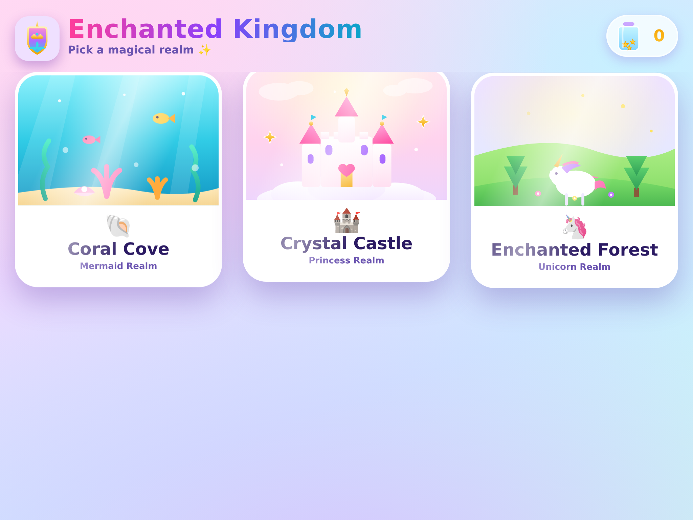
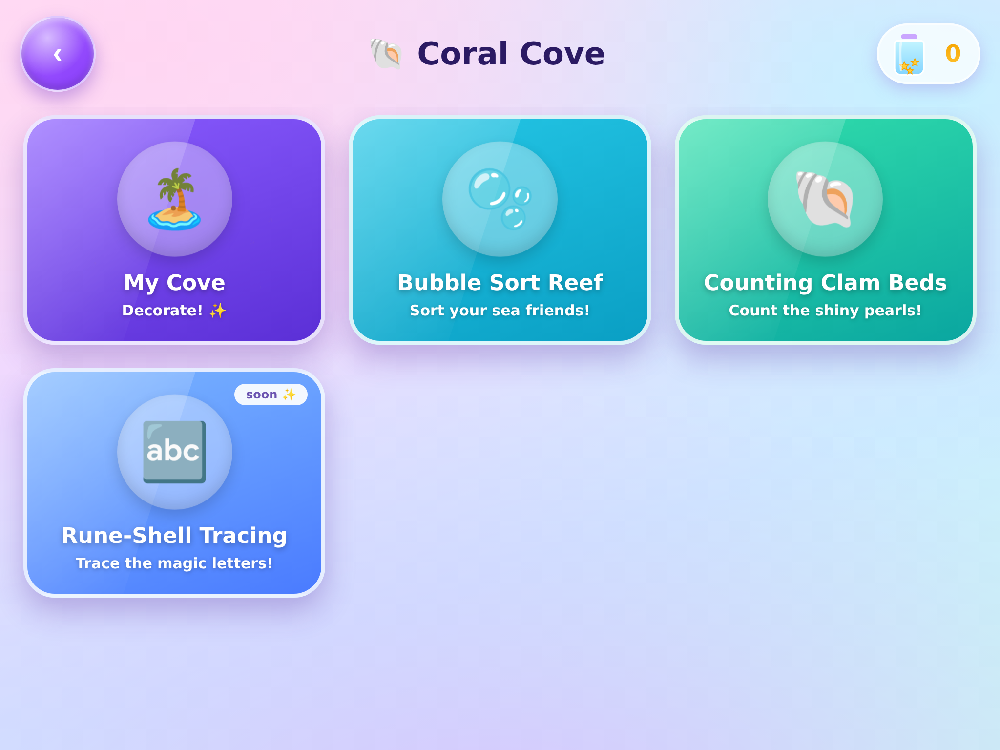
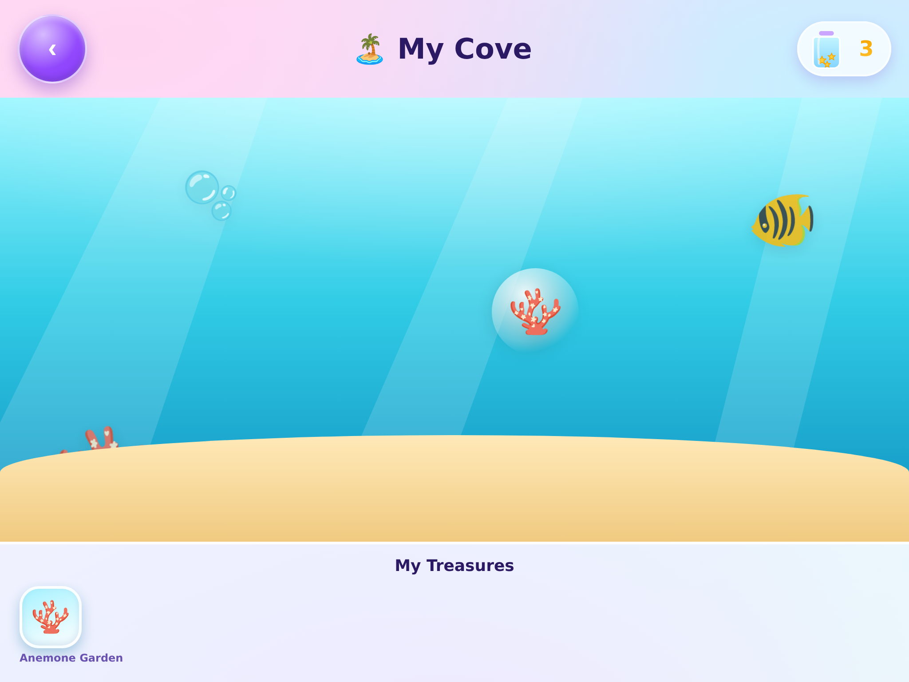

# 🏰 Enchanted Kingdom ✨

A magical, no-fail learning game for ages **4–6** — explore three realms of
princesses, unicorns and mermaids while practising early math, patterns and
counting. Built as a **single self-contained web app** you can add to an
iPad/iPhone Home Screen; it runs full-screen and works offline.

> No timers, no fail states, no ads, no accounts, no network. Progress is saved
> on the device. One `index.html` — no build step required to run it.

<p align="center">
  
</p>

## ✨ What's inside

**Three realms** on a floating selection map:

- 🐚 **Coral Cove** (Mermaid Realm) — *playable*
  - **Bubble Sort Reef** — sort sea friends by colour → shape → size, then continue a pattern.
  - **Counting Clam Beds** — tap clams for pearls; add & subtract by grouping in Marina's basket.
  - **Rune-Shell Tracing** — trace glowing letters (C, O, T, L) with a sparkle trail; hear the
    phonic sound and meet a sea creature (C is for Crab!). Early literacy + fine-motor.
  - **My Cove** — a decorator: earn treasures and drag them to style your reef.
- 🏰 **Crystal Castle** (Princess Realm) — *playable*
  - **Royal Gem Match** — flip glossy jewel cards to find matching pairs (memory / concentration),
    three gentle rounds (3 → 4 → 5 pairs). No timer, no fail.
  - **Crown Jewels** — pattern game (coming soon).
- 🦄 **Enchanted Forest** (Unicorn Realm) — styled activity cards (coming soon).

**Design for little hands:** jumbo touch targets, icon-first navigation, glossy
"bubble" buttons that squish and burst with stars on every tap, gentle chimes,
and a **star-jar** reward counter that fills as activities are completed.

<p align="center">
  
  
</p>

## 📲 Add it to a Home Screen (the fun part)

Once the site is live (see **Hosting** below), on the iPad/iPhone:

1. Open the site's URL **in Safari**.
2. Tap **Share** (□↑) → **Add to Home Screen** → **Add**.
3. Launch **Enchanted Kingdom** from the Home Screen — it opens full-screen with
   its own shield-crest icon, no address bar, and works offline afterwards.

## ☁️ Hosting with GitHub Pages

`index.html` is at the repo root, so GitHub Pages can serve it as-is:

1. Push this repo to GitHub.
2. Repo **Settings → Pages**.
3. **Build and deployment → Source: Deploy from a branch**, **Branch: `main` / `/ (root)`**, **Save**.
4. After a minute the app is live at:
   `https://<your-username>.github.io/<repo-name>/`

(Any static host works too — e.g. drag `index.html` onto Netlify Drop.)

## 🗂️ Project structure

```
.
├── index.html            # the app (self-contained; this is what ships)
├── DESIGN-TOKENS.md      # the design system: colours, components, UX rules
├── screenshots/          # preview images
└── build/                # tooling to regenerate index.html
    ├── index_template.html   # authored source (with __ICON__/__MANIFEST__ tokens)
    ├── emblem.html           # the shield-crest emblem, as SVG
    ├── render_emblem.mjs     # SVG → PNG (headless Chromium)
    ├── render_icons.mjs      # SVG → square app-icon base PNG
    ├── gen_icons.py          # resize to icon-180/192/512 + base64 bundle
    ├── build.py              # inline icons + manifest → ../index.html
    ├── package.json          # `npm run all` rebuilds everything
    └── assets/               # rendered emblem + icon PNGs + icons_b64.json
```

## 🛠️ Rebuilding

You only need this if you change the emblem or the template. The shipped
`index.html` is already built.

```bash
cd build
npm install            # installs Playwright (for rendering the emblem)
npm run all            # render emblem → icons → inline-build ../index.html
# or just re-inline without re-rendering icons:
python3 build.py
```

Requirements: Node 18+, Python 3 with Pillow (`pip install pillow`).

## 🧩 Tech notes

- **Single file, zero runtime dependencies.** All art (SVG + emoji), sound
  (WebAudio), game logic and save data live in `index.html`.
- **Offline-first.** Nothing calls the network; Safari caches the app once it's
  on the Home Screen.
- **Persistence.** `localStorage` with an automatic in-memory fallback (so it
  never breaks in private mode or a preview sandbox).
- **iOS web-app meta** + inline web manifest for a proper standalone launch and
  Home Screen icon.

## 🗺️ Roadmap

- Build the remaining games (Crown Jewels, Rainbow Bridge, Starflower Count).
- More letters in Rune-Shell Tracing (and lowercase).
- Quiet parent corner (mute + reset progress).
- Optional service worker for guaranteed offline.

## 📄 License

MIT — see [LICENSE](LICENSE).

---

<sub>Made with care for a very specific 5-year-old. 💖</sub>
